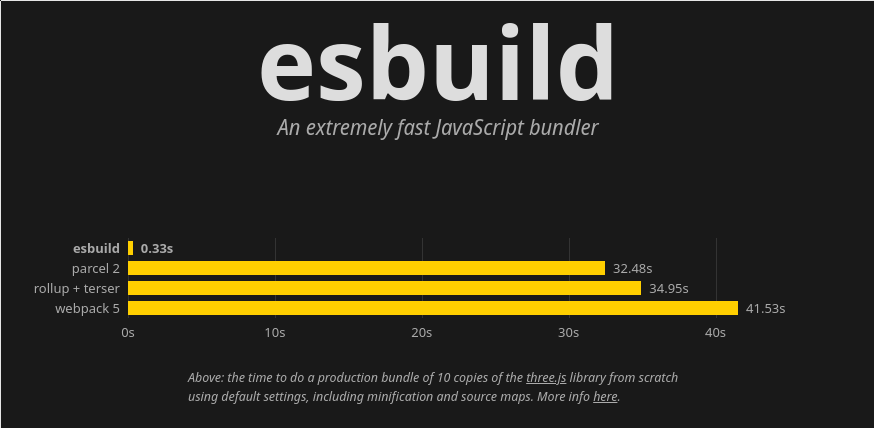

# Vite

(prounounced as "veat", French for 'rapid,quickly')

## Useful Resources

- [Docs](https://vitejs.dev/)
- [Why Vite](https://vitejs.dev/guide/why.html)
- [Getting Started with Vite](https://vitejs.dev/guide/)
- [Vite and VitePress - Evan You](https://www.youtube.com/watch?v=xXrhg26VCSc)

### Webpack, oh fun!

- The introduction of webpack into the web front-end ecosystem was a huge step forward for authoring complex web applications.
- However, over time I (and perhaps you) noticed several pain points when using webpack:
    - Slow startup times for complex, large projects.
    - "Fun" experiences with configuring webpack.
    - Hot Module Reloading / Code Reloading in development environments was broken.
    - Overall: my development experience == [😱, 🤢, 😭]

### In Comes Evan You!

- Evan You, the creator of the Vue.js framework, decides to help the modern web front-end ecosystem even more by working on a web build tool called "Vite".
- It's built for the future of ES Modules on the web. Instead of using CommonJS based modules Vite embraces ES Modules and is able to leverage newer technologies because of this.
- The emphasis and focus is **performance**. Uses [esbuild](https://esbuild.github.io/) under the hood, which is a JavaScript bundler built in Go.

  
  
Look at those esbuild times! (per https://esbuild.github.io/)

