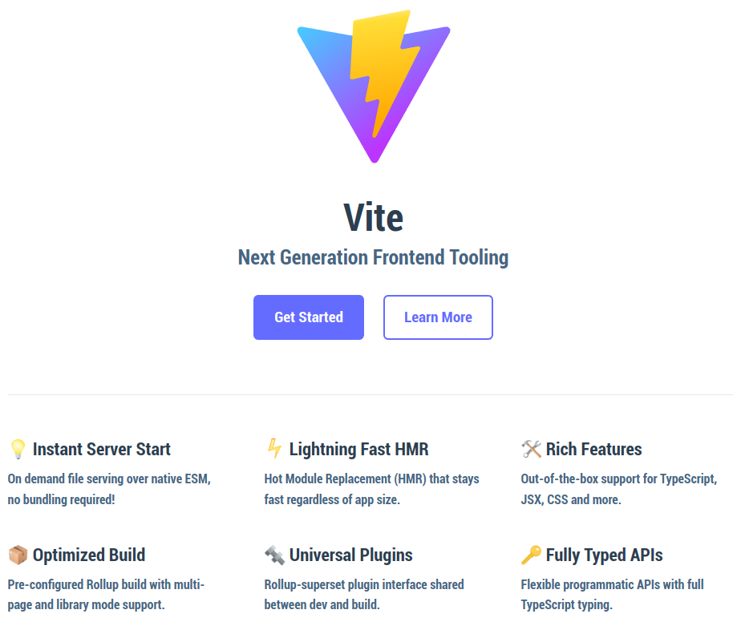

# Vite

(prounounced as "veat", French for 'rapid,quickly')

  

## Useful Resources

- [Docs](https://vitejs.dev/)
- [Why Vite](https://vitejs.dev/guide/why.html)
- [Getting Started with Vite](https://vitejs.dev/guide/)
- [Vite and VitePress - Evan You](https://www.youtube.com/watch?v=xXrhg26VCSc)

### Quick tl;dr about a web module bundler

A web module bundler is a tool that's used to help generate static assets from
framework code (like Angular TypeScript, React JSX, Vue SFC, etc...) and their dependencies
into code that can be served on a web browser. Examples include Webpack, Parcel, Rollup, and Vite. If you use a CLI tool like the Angular CLI, Vue CLI, Next.js, or `create-react-app` these are wrappers that use a web module bundler under the hood.

### Webpack, oh fun!

- The introduction of webpack into the web front-end ecosystem was a huge step forward for authoring complex web applications.
- However, over time I (and perhaps you) noticed several pain points when using webpack:
    - Slow startup times for complex, large projects.
    - "Fun" experiences with configuring webpack.
    - Hot Module Reloading / Code Reloading in development environments was broken.
    - Overall: my development experience == [😱, 🤢, 😭]

### In Comes Evan You!

- Evan You, the creator of the Vue.js framework, decides to help the modern web front-end ecosystem even more by working on a web build tool called "Vite".
- It's built for the future of ES Modules on the web. Instead of using CommonJS based modules Vite embraces ES Modules and is able to leverage newer technologies because of this.
- The emphasis and focus is **performance**. Uses [esbuild](https://esbuild.github.io/) under the hood, which is a JavaScript bundler built in Go.
- Traditional bundlers require a full build of the entire app for reloads. Since Vite uses ESM with browser support, we only need to rebuild the truly changed ES module and the browser will just load that part (saving a TON of time, especially if your project is large and complex!).

  
  
Look at those esbuild times! (per https://esbuild.github.io/)

