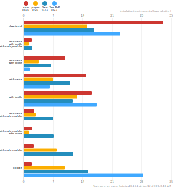
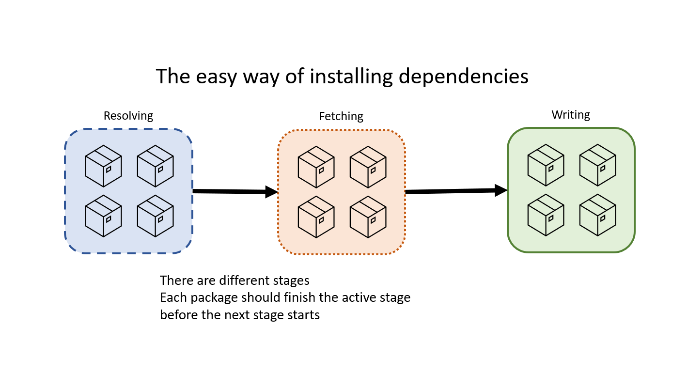
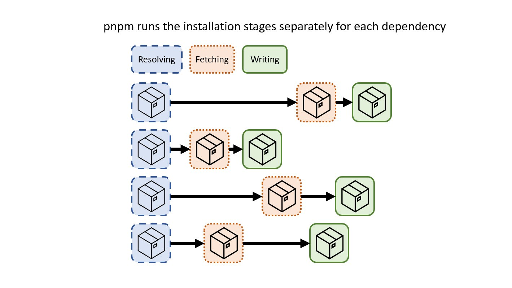

# pnpm

Yep: _another JavaScript package manager_. However trust me on this one: this one is fast and has a lot of goodies!

## tl;dr about package managers

Package managers help you get dependencies for your projects. If you've used JavaScript, you may have ran `npm` or `yarn`. These are the most common and popular package managers out there.

## Useful Resources

- [Docs](https://pnpm.io/)

## Why PNPM

### Performance

(sourced per https://pnpm.io/benchmarks)

  

Why is pnpm so crazy fast compared to other "traditional" package managers?

pnpm doesn't have blocking stages of installation. Each dependency has its own stages and the next stage starts as soon as possible.

  

  

### Yarn Breaking Changes

If you've been using Yarn, you may be aware of Yarn version 2. Yarn version 2 was introduced in 2020, but hasn't seen wide adoption across the ecosystem as version 1 did. Version 2 has different philosophies and is quite a bit different from version 1 which had a more NPM-like interface. This has led to... [some drama in the Yarn community](https://github.com/yarnpkg/berry/issues/766#issuecomment-578434425).

Yarn version 1 has been in maintenance mode for a while now, [and will eventually be archived very soon](https://dev.to/arcanis/introducing-yarn-2-4eh1#what-will-happen-to-the-legacy-codebase).

Having a package manager that is is maintained is very important since package dependencies have unfortunately been a common vector for security issues in the JS ecosystem.

### And those other goodies I promised!

- [Out of the box monorepo support built-in.](https://pnpm.io/workspaces)
- File System wide caching. If you have a bunch of projects that use React as a dependency, that specific version of React is installed in a global PNPM store. This helps TREMENDOUSLY if you have multiple projects with similar or shared dependencies on a machine you're working on. This can also be leveraged within CI/CD environments for CI/CD speed wins :) .
