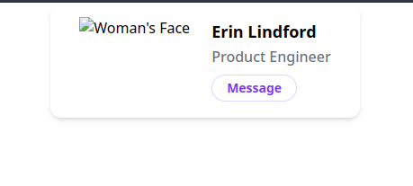

# Windi CSS

A CSS framework built on the philosophy and concept of utility classes.

## tl;dr about CSS frameworks like WindiCSS

WindiCSS is a framework that will generate and give you compiled CSS classes
for "utility based" styling. This is the approach of using multiple CSS classes
on an HTML element to describe its styling vs a semantic CSS class. This approach has
advantages and disadvantages over the semantic approach (further details to be shown!)

## Useful Resources

- [Docs](https://windicss.org/guide/)

## Overview

- Windi CSS is a just-in-time CSS framework with utility classes. The approach and philosophy of this framework is that instead of using custom made CSS classes, you write the provided utility classes in the HTML.

## Example of the HTML / CSS in WindiCSS

```html
<div class="py-8 px-8 max-w-sm mx-auto bg-white rounded-xl shadow-md space-y-2 sm:(py-4 flex items-center space-y-0 space-x-6)">
  
  <div class="text-center space-y-2 sm:text-left">
    <div class="space-y-0.5">
      <p class="text-lg text-black font-semibold">Erin Lindford</p>
      <p class="text-gray-500 font-medium">Product Engineer</p>
    </div>
    <button class="px-4 py-1 text-sm text-purple-600 font-semibold rounded-full border border-purple-200 hover:(text-white bg-purple-600 border-transparent) focus:(outline-none ring-2 ring-purple-600 ring-offset-2)">
      Message
    </button>
  </div>
</div>
```

<p align="center">
  
</p>

## Things I like and do not like

### I like

- Speed and prototyping of components. If you install [the VSCode extension for Windi CSS](https://windicss.org/editors/vscode) you'll feel like Sonic the Hedgehog when writing out styles. It's really awesome when you have it setup with Vite since you _almost_ don't even need to use the browser dev tools since the code change with styling is _immediate_ upon code change.
- The consistent spacing and rem-first approach with the utilities. Rems are more web accessible than pixels and I like being able to have consistent spacing with using `m-5` and `p-5`.
- Responsiveness is EASY. Just add a breakpoint prefix and you don't have to worry about managing weird breakpoint media queries in your CSS files ever again!


### I do not like

- Maintenance of the HTML code becomes more tough. The HTML class names can get _really_ long (like the example above).
- It's hard to make the classes work with props in a framework like React. Especially since the classes cannot be dynamic if you're using the just-in-time compilation method.


## In my opinion

This has been tremendously helpful with getting styles up off the ground and looking great. Once a project has grown to an "enterprise" point I would start considering breaking the utility classes into semantic classes as they are much easier to maintain over a longer time in my opinion :) .
